# Settlement Process Flow - Complete Diagram

## Single Comprehensive Flow Diagram

### ⚠️ EASIEST WAY: Use the Raw File

**Open this file**: `SETTLEMENT_FLOW_MERMAID_RAW.txt` (in the same folder)

1. Open the `.txt` file
2. Select All (Cmd+A / Ctrl+A)
3. Copy (Cmd+C / Ctrl+C)
4. Go to https://mermaid.live/
5. Paste (Cmd+V / Ctrl+V)
6. Done! ✅

---

### Alternative: Copy from Below

**CRITICAL**: Copy ONLY the code starting from `flowchart TD` and ending at the last `style` line. 

**DO NOT copy:**
- ❌ The ```mermaid marker
- ❌ The ``` closing marker
- ❌ Any text before `flowchart TD`
- ❌ Any text after the last `style` line

**DO copy:**
- ✅ Everything from `flowchart TD` to the last `style` line

```mermaid
flowchart TD
    Start([User Creates Commitment]) --> SetupIntent[Setup Intent: Save Payment Method]
    SetupIntent --> Auth[Calculate Authorization<br/>max_charge_cents]
    Auth --> WeekStart[Week Starts: Monday 12:00 ET]
    
    WeekStart --> TrackUsage[Extension Tracks Daily Usage<br/>Stored in App Group]
    
    TrackUsage --> MondayDeadline{Monday 12:00 ET<br/>Week Deadline}
    
    MondayDeadline --> UserOpensApp{User Opens App?}
    
    UserOpensApp -->|Yes| SyncUsage[UsageSyncManager.syncToBackend]
    UserOpensApp -->|No| WaitForTuesday[Wait for Tuesday 12:00 ET]
    
    SyncUsage --> RpcSync[rpc_sync_daily_usage]
    RpcSync --> CalculatePenalty[Calculate total_penalty_cents<br/>from daily_usage rows]
    CalculatePenalty --> UpdatePenalties[Update user_week_penalties<br/>total_penalty_cents]
    UpdatePenalties --> WaitForTuesday
    
    WaitForTuesday --> TuesdayNoon{Tuesday 12:00 ET<br/>Grace Period Expires}
    
    TuesdayNoon --> RunSettlement[Run: bright-service/run-weekly-settlement]
    
    RunSettlement --> FetchCommitments[Fetch commitments for week]
    FetchCommitments --> ForEachCommitment{For Each Commitment}
    
    ForEachCommitment --> CheckSettled{Already<br/>Settled?}
    CheckSettled -->|Yes| SkipSettled[Skip: alreadySettled++]
    CheckSettled -->|No| CheckUsage{Has Synced<br/>Usage?}
    
    CheckUsage -->|Yes| CheckGrace1{Grace Period<br/>Expired?}
    CheckUsage -->|No| CheckGrace2{Grace Period<br/>Expired?}
    
    CheckGrace1 -->|No| SkipGrace1[Skip: graceNotExpired++]
    CheckGrace1 -->|Yes| ChargeActualPath[Charge Type: actual]
    
    CheckGrace2 -->|No| SkipGrace2[Skip: graceNotExpired++]
    CheckGrace2 -->|Yes| ChargeWorstCasePath[Charge Type: worst_case]
    
    ChargeActualPath --> GetActualAmount[Get actual_penalty_cents<br/>from user_week_penalties]
    GetActualAmount --> CapActual[Cap at max_charge_cents<br/>MIN actual, authorization]
    CapActual --> CreatePaymentIntent1[Create Stripe PaymentIntent<br/>Amount: capped actual]
    CreatePaymentIntent1 --> RecordPayment1[Record Payment<br/>Type: penalty_actual]
    RecordPayment1 --> UpdateStatus1[Update user_week_penalties<br/>Status: charged_actual<br/>charged_amount_cents: capped actual<br/>actual_amount_cents: true actual]
    
    ChargeWorstCasePath --> GetWorstCaseAmount[Get max_charge_cents<br/>from commitment]
    GetWorstCaseAmount --> CreatePaymentIntent2[Create Stripe PaymentIntent<br/>Amount: max_charge_cents]
    CreatePaymentIntent2 --> RecordPayment2[Record Payment<br/>Type: penalty_worst_case]
    RecordPayment2 --> UpdateStatus2[Update user_week_penalties<br/>Status: charged_worst_case<br/>charged_amount_cents: max_charge_cents<br/>actual_amount_cents: 0 unknown]
    
    UpdateStatus1 --> SettlementComplete([Settlement Complete])
    UpdateStatus2 --> SettlementComplete
    SkipSettled --> SettlementComplete
    SkipGrace1 --> SettlementComplete
    SkipGrace2 --> SettlementComplete
    
    SettlementComplete --> NextCommitment{More<br/>Commitments?}
    NextCommitment -->|Yes| ForEachCommitment
    NextCommitment -->|No| CheckLateSync{User Syncs<br/>After Settlement?}
    
    CheckLateSync -->|No| End([End])
    CheckLateSync -->|Yes| LateSync[User Opens App After Tuesday Noon]
    
    LateSync --> LateSyncUsage[UsageSyncManager.syncToBackend]
    LateSyncUsage --> LateRpcSync[rpc_sync_daily_usage]
    LateRpcSync --> LateCalculatePenalty[Calculate total_penalty_cents<br/>from daily_usage rows]
    LateCalculatePenalty --> GetMaxCharge[Get max_charge_cents<br/>from commitment]
    GetMaxCharge --> CapActualLate[Cap actual at authorization<br/>capped_actual = MIN actual, max_charge]
    
    CapActualLate --> CheckSettledStatus{Previous<br/>Settlement<br/>Status?}
    
    CheckSettledStatus -->|Not Settled| NoReconciliation[No Reconciliation Needed<br/>Status: pending]
    CheckSettledStatus -->|charged_actual<br/>charged_worst_case<br/>refunded<br/>refunded_partial| CalculateDelta[Calculate Reconciliation Delta<br/>delta = capped_actual - charged_amount]
    
    CalculateDelta --> CheckDelta{Delta = 0?}
    
    CheckDelta -->|Yes| NoReconciliation
    CheckDelta -->|No| FlagReconciliation[Flag for Reconciliation<br/>needs_reconciliation = true<br/>reconciliation_delta_cents = delta<br/>reconciliation_reason = late_sync_delta]
    
    FlagReconciliation --> RunReconcile[Run: quick-handler/settlement-reconcile]
    RunReconcile --> FetchCandidates[Fetch reconciliation candidates<br/>needs_reconciliation = true]
    FetchCandidates --> ForEachCandidate{For Each Candidate}
    
    ForEachCandidate --> CheckDeltaSign{Delta < 0?}
    
    CheckDeltaSign -->|Yes| RefundPath[Refund Path]
    CheckDeltaSign -->|No| ValidateDelta[Validate: Delta > 0?]
    
    ValidateDelta -->|Yes| SkipInvalidDelta[Skip: invalid_positive_delta<br/>Late syncs can only refund,<br/>never charge extra]
    ValidateDelta -->|No| NoReconciliation2[No Reconciliation<br/>Delta = 0]
    
    RefundPath --> CheckPaymentIntent{Has charge_payment_intent_id?}
    CheckPaymentIntent -->|No| SkipRefund[Skip: missing_payment_intent]
    CheckPaymentIntent -->|Yes| CreateRefund[Create Stripe Refund<br/>Amount: abs delta]
    CreateRefund --> UpdateRefund[Update user_week_penalties<br/>Status: refunded or refunded_partial<br/>refund_amount_cents += abs delta<br/>charged_amount_cents -= abs delta<br/>needs_reconciliation = false]
    UpdateRefund --> RecordRefundPayment[Record Payment<br/>Type: penalty_refund]
    
    RecordRefundPayment --> ReconciliationDone([Reconciliation Complete])
    SkipRefund --> ReconciliationDone
    SkipInvalidDelta --> ReconciliationDone
    NoReconciliation2 --> ReconciliationDone
    NoReconciliation --> ReconciliationDone
    
    ReconciliationDone --> NextCandidate{More<br/>Candidates?}
    NextCandidate -->|Yes| ForEachCandidate
    NextCandidate -->|No| End
    
    style Start fill:#e1f5ff
    style End fill:#d4edda
    style SettlementComplete fill:#d4edda
    style ReconciliationDone fill:#d4edda
    style ChargeActualPath fill:#fff3cd
    style ChargeWorstCasePath fill:#f8d7da
    style CapActual fill:#ffeaa7
    style CapActualLate fill:#ffeaa7
    style RefundPath fill:#d1ecf1
    style ValidateDelta fill:#fff3cd
    style SkipInvalidDelta fill:#f8d7da
    style CheckDeltaSign fill:#fff3cd
```



---

## How to Use

### Option 1: Copy from this file
1. **Open Mermaid Live Editor**: https://mermaid.live/
2. **Copy ONLY the code** between the ```mermaid and ``` markers above
   - **DO NOT** copy the ```mermaid or ``` markers themselves
   - Start copying from `flowchart TD` and end at the last `style` line
3. **Paste into the editor**
4. **Export as PNG/SVG** for printing or documentation

### Option 2: Use the raw file (EASIER)
1. **Open**: `SETTLEMENT_FLOW_MERMAID_RAW.txt` 
2. **Select All** (Cmd+A / Ctrl+A) and **Copy** (Cmd+C / Ctrl+C)
3. **Paste** directly into https://mermaid.live/
4. **Export as PNG/SVG**

This single diagram shows:
- ✅ Commitment creation and authorization
- ✅ Usage tracking and syncing
- ✅ Settlement decision logic (actual vs worst case)
- ✅ Authorization cap enforcement
- ✅ Late sync reconciliation flow
- ✅ Refund logic (extra charges are impossible for late syncs)
- ✅ All decision points and outcomes
